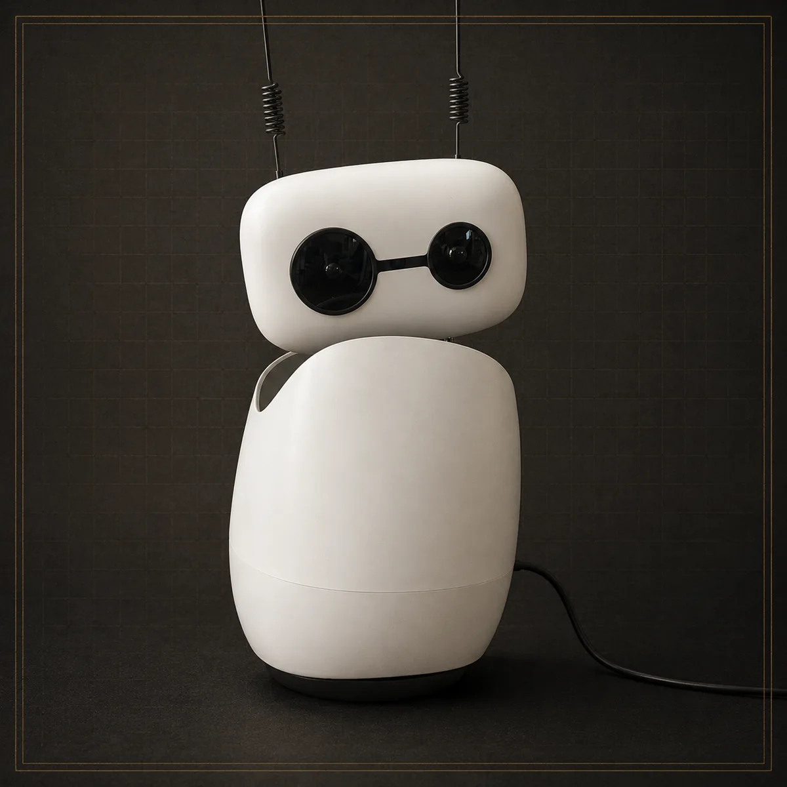
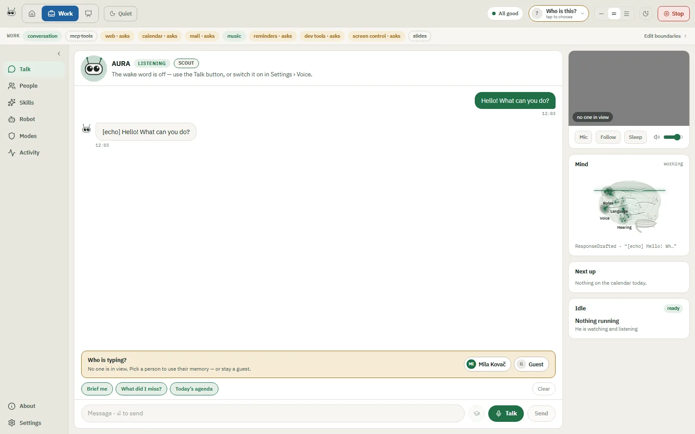
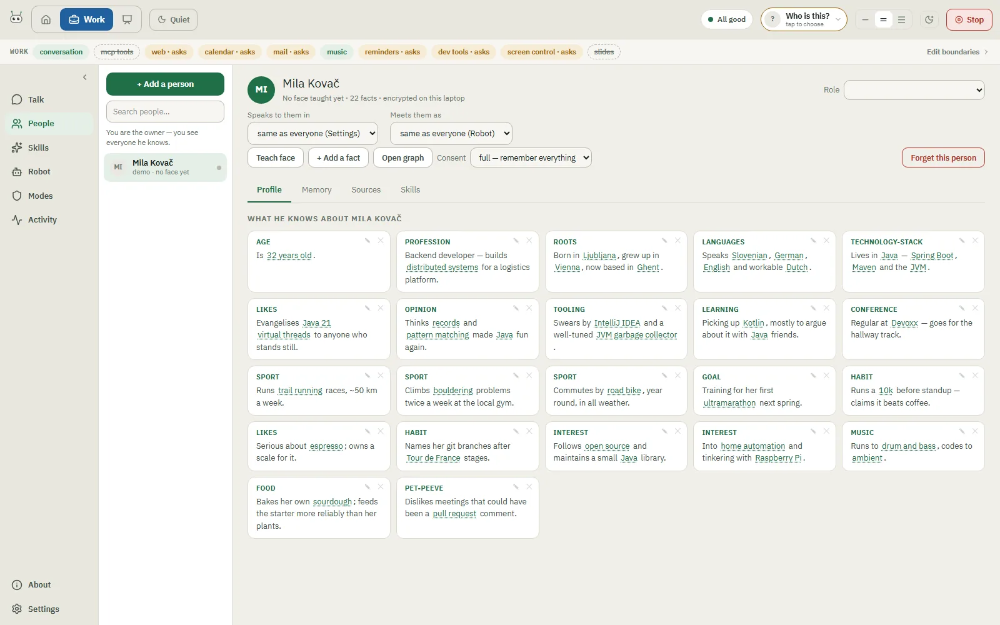
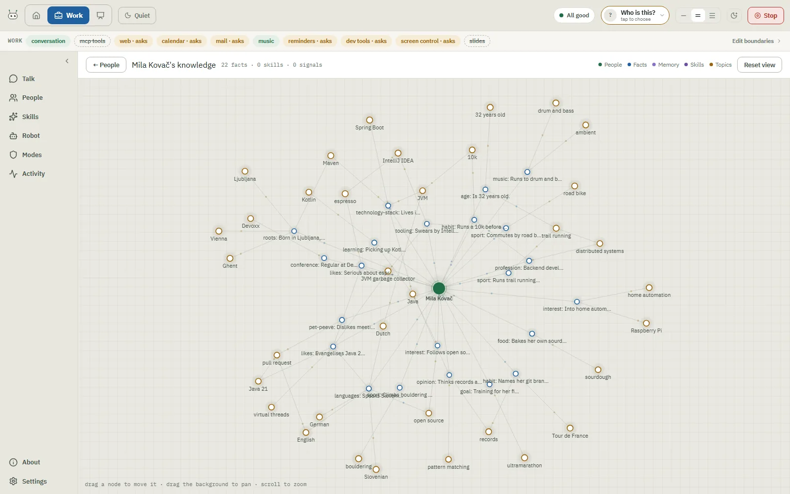
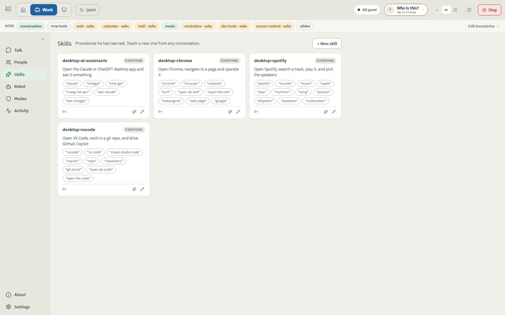
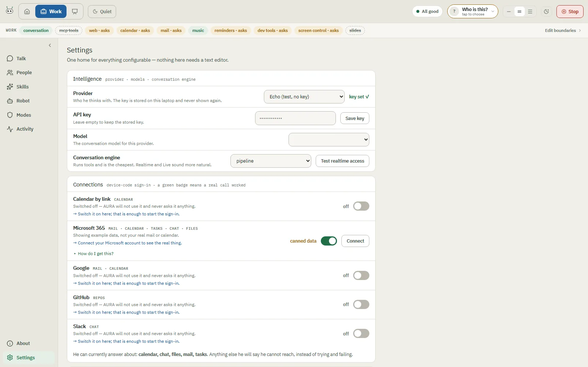
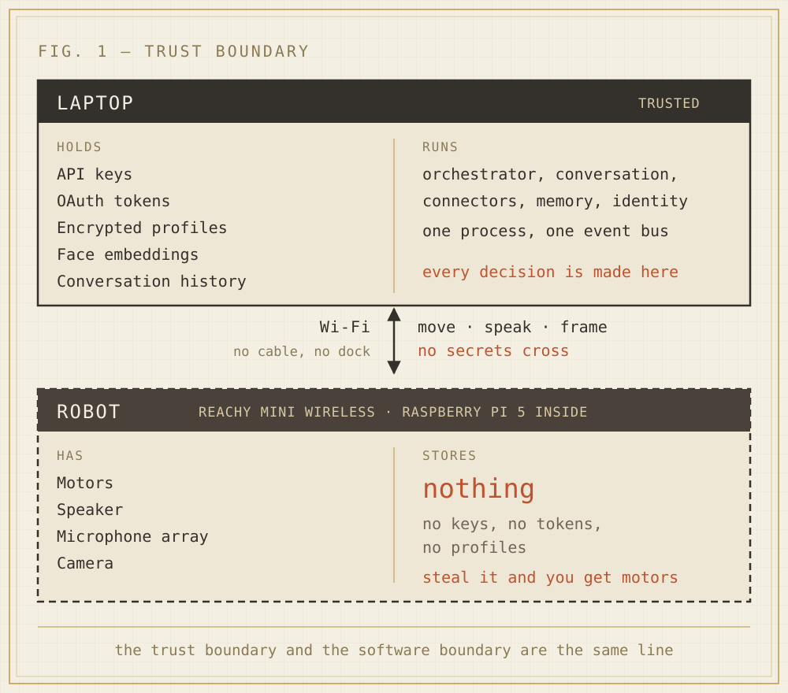
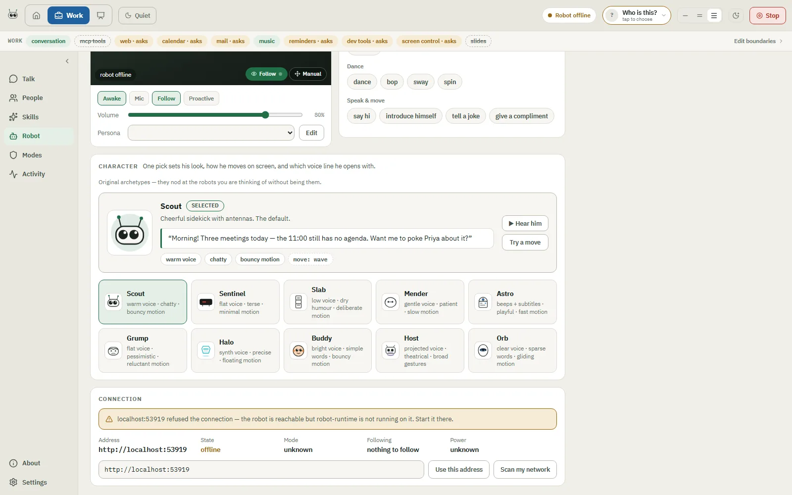

# AURA — Adaptive Unified Robotic Assistant

> **A desk robot that knows who you are, joins your workday, and keeps your
> life private — on your own laptop.**

<p align="center">
  
</p>

AURA turns a **Reachy Mini** into a personal chief-of-staff. It recognises the
person in front of it, holds a real spoken conversation, reaches into mail,
calendar, chat and tasks, learns how *you* work, and moves like it means it.

The interesting part is where things live. Every key, every profile, every face
embedding stays on your laptop, encrypted with a passphrase only you have. The
robot on the desk holds nothing at all — steal it and you get motors. And
because the robot is only a body, **the entire system runs without one**, which
is how most of it was built.

**[Download the app](https://github.com/janvanwassenhove/aura/releases/latest)** ·
[What you need](#what-you-need) ·
[How it fits together](#how-it-fits-together) ·
[How it was built](docs/implementation-backlog.md) ·
[Architecture decisions](docs/adr/)

---

## See it

<p align="center">
  
</p>

<p align="center">
  
  
</p>

<p align="center">
  
  
</p>

*Captured from a demo build. The only profile in these images is fictional — the
release pipeline photographs a throwaway stack precisely so no real one can
appear here.*

### The name is the promise

| | |
|---|---|
| **Adaptive** | Adapts behaviour and interaction to the person, the context and the situation. |
| **Unified** | Brings conversation, mail, Teams, calendar, todos, memory and agents together in one place. |
| **Robotic** | Physically embodied through Reachy Mini — it looks at you, reacts, gestures. |
| **Assistant** | A personal assistant and copilot, not just another chatbot. |

### Why it feels different

- **It looks at you and talks back.** Spoken replies over a live audio session,
  head tracking that follows your face, gestures timed to the words. Say "Hey
  Richie" and just talk.
- **It knows the room.** Faces are recognised, new visitors become guests, and
  every person gets their own encrypted profile — greeting, tone and context
  adapt to who is standing there.
- **It does the work.** Mail, calendar, Teams, todos, music, screen control and
  dev tasks behind one conversation, with approval gates on anything sensitive.
- **It gets better by itself.** Skills are written from real usage — and the
  assistant may *propose* one, but only you can save it.
- **It keeps running when the internet doesn't.** Offline tier, local models,
  and a robot that behaves gracefully instead of freezing.
- **Privacy is the product, not a checkbox.** AES-256-GCM per-person
  encryption, biometrics that never touch disk unencrypted, a step-up gate on
  destructive actions, and a scanner that blocks personal data from ever
  reaching git.

---

## What you need

**Short answer: a laptop. The robot is optional, and it was optional for most
of this project's life** — the physical Reachy arrived months after development
started, and everything until then was built and tested against a fake robot
that speaks the same network contract.

### To try the whole system — no hardware, no keys, no account

| | |
|---|---|
| A laptop | Windows, macOS (Apple Silicon or Intel) or Linux |
| Nothing else | `ROBOT_ADAPTER=fake` and `LLM_PROVIDER=echo` are the defaults in the dev environment |

You get the console, the brain, the encrypted knowledge store, the graph,
skills, the approval gate and the event log. Replies come back as `[echo] …`
because no model is attached, which is enough to walk the whole system.

### To have real conversations

| | |
|---|---|
| An API key | OpenAI, OpenRouter or Google Gemini — one is enough |
| Optional: a Microsoft 365 licence | Only for the live Work IQ connector; `M365_CONNECTOR=mock` needs no licence and no account |

### To give it a body

| | |
|---|---|
| A **[Reachy Mini](https://pollen-robotics.com/reachy-mini/) Wireless** | The wireless model, please: it has the Raspberry Pi 5, the battery and the radio *inside* the robot, so it is a host on your network rather than a peripheral on a cable. The two-machine split in this repository assumes exactly that. Robot by [Pollen Robotics](https://pollen-robotics.com/) / [Hugging Face](https://huggingface.co/blog/reachy-mini); the vendor SDK this project's adapter talks to is [pollen-robotics/reachy_mini](https://github.com/pollen-robotics/reachy_mini). |
| The same Wi-Fi | Laptop and robot on one network; the robot is reached at `reachy-mini.local:8001`, or by address |
| Optional: the face-recognition extra | Face recognition needs the `[recognition]` extra (insightface). Without it the system runs fine and recognition stays inert. Note that insightface's pretrained models are published for non-commercial research use — check the licence of any model you ship. |

Without the robot you lose exactly three things: motion, the camera (so face
recognition and gestures), and room audio. Everything else — the whole brain,
every connector, the approval machinery, the knowledge layer — behaves
identically.

### To develop on it

| | |
|---|---|
| Python 3.11+ and [uv](https://docs.astral.sh/uv/) | The workspace is a uv monorepo |
| Node 20+ | For the Vue console and the Electron shell |
| git | And one command to arm the privacy gate, below |

---

## How it fits together

**Two machines, and one of them is deliberately stupid.** Everything that could
identify you lives on the laptop. The robot serves motion, audio and camera
frames, and stores nothing at all.



**One conversational turn.** A fast model answers most turns from a short
context. Only turns that need tools reach the stronger model, and anything that
touches the outside world stops at the approval gate first.


More drawings — the loops that run whether or not anyone is talking, the
knowledge model, envelope encryption, the bounds on a delegated agent — live in
**[docs/diagrams/](docs/diagrams/)**, and the written architecture is in
**[docs/architecture/overview.md](docs/architecture/overview.md)**.

---

## Install (no build required)

Grab the installer for your platform from the
[latest release](https://github.com/janvanwassenhove/aura/releases/latest) —
Windows (`.exe`), macOS (`.dmg`, Apple Silicon + Intel) or Linux
(`.AppImage`/`.deb`). First launch installs its own Python runtime; the app
then checks for updates and offers to install them for you.

## Quick start (from source)

**Dry run — no hardware, no keys:**

```bash
cp infra/dev/.env.example infra/dev/.env       # defaults: FakeRobot + echo LLM + mock M365
docker compose -f infra/dev/docker-compose.yml up --build
```

Open the console at http://localhost:5173 and type a message.

**Device day (real Reachy):** run the guided setup wizard, then follow
[docs/setup-guide.md](docs/setup-guide.md):

```bash
uv run python -m aura_brain.wizard
```

The wizard configures the robot link, LLM provider + key, voice pipeline,
offline resilience, security (encryption passphrase, phone step-up approvals),
and seeds your household — owner, family, guests, minors — straight into the
encrypted knowledge store.

## What AURA does

- **Recognises people** and personalises: greeting, context, and tone follow
  who is in front of it (recognition *identifies*; it never *authenticates*).
- **Chief-of-staff turns**: calendar/mail via M365 (mock or Work IQ MCP),
  todos, reminders — with an **approval gate** on every sensitive action.
- **Dev assistance**: an outbound dev agent that can read repos freely but
  needs explicit approval for every write, commit, or push (off by default).
- **Presentations**: synced speech + gesture co-pilot with slide navigation.
- **Voice**: offline STT/TTS (whisper.cpp, kokoro) or the OpenAI Realtime
  speech-to-speech transport with barge-in — a real state machine with
  INTERRUPTED as a first-class state
  ([details](docs/voice-conversation.md)).
- **Survives failures**: heartbeat monitoring degrades gracefully — local LLM
  when the internet dies, regex fallback after that, and an on-device loop so
  the robot stays polite even with no brain at all.
- **Always stoppable**: one **Stop** button cuts speech mid-word, ends the
  conversation and mutes the microphone — because a voice assistant that can
  be triggered by ambient noise must be silenceable in one click.

<p align="center">
  
</p>

*What a failure looks like: not a spinner, but the reason plus the field that
fixes it.*

## Security model (ADR-008)

| Principle | Mechanism |
|-----------|-----------|
| Profiles encrypted at rest | AES-256-GCM envelope: per-person DEK wrapped by an owner master key (scrypt from your passphrase) |
| The passphrase is yours alone | Held in the OS credential store, written only after being read back — there is one copy, and losing it means the data is gone |
| Local-only | Knowledge never egresses; prompts get a minimal role-based slice, never the profile |
| Minors protected | `role=minor` → explicit facts only, no passive learning, ever (consent is owner-granted, explicit) |
| Right to be forgotten | Deleting a person destroys their key — cryptographic erasure |
| Destructive ops gated | Phone step-up approval via webhook when configured; otherwise a typed confirmation from the owner's own console (erasure must never be impossible) |
| Sensitive actions gated | The gate is code in the tool path, not a line in a prompt. It can only be relaxed by the owner, per tool, with a checkbox that writes itself into the settings file. Offline-queued actions never auto-execute on reconnect |
| The robot is dumb | The Pi holds no keys, tokens, or data — stealing it yields motors |
| No secrets in logs | Tokens never logged; keyring-backed storage |


Transparency: the console's **brain** panel shows every person, every fact
(editable), every observed signal (with confidence) — and the lock state.

## Repository layout

```
apps/
├── aura-brain/           # THE laptop process: all five modules on one bus + wizard
├── operator-console/     # Vue 3 + Pinia console
└── desktop/              # Electron shell: spawns the brain, serves the console

services/
├── robot-runtime/        # Runs on the Pi: RobotAdapter, behavior engine, offline loop
├── orchestrator/         # Pipeline, approval gate, personas, dev agent, presentations
├── conversation-runtime/ # STT/TTS providers + Realtime transport
├── connector-service/    # M365 (mock/Work IQ), google, github, slack
├── memory-service/       # Sessions, todos, reminders (SQLite)
└── identity-service/     # Tokens (OS keyring), persona, mode

packages/
├── shared-schemas/       # Pydantic events + knowledge layer (store, crypto, judgment)
├── shared-events/        # AsyncEventBus + WebSocket broadcaster
├── shared-policies/      # Approval rules, mode access control
├── shared-personas/      # Persona definitions & system prompts
└── shared-prompts/       # Prompt templates

infra/
├── dev/                  # docker-compose (3 services), .env.example
└── two-host-bringup.md   # Laptop ↔ Pi bring-up

docs/
├── setup-guide.md             # ★ Device day: unboxing → talking robot
├── diagrams/                  # ★ The canonical drawings — keep them true
├── architecture/overview.md   # Written architecture
├── implementation-backlog.md  # The autonomous build ledger (source of truth)
└── adr/                       # Architecture decision records (ADR-001…008)
```

The five laptop services are **mounted into one `aura-brain` process** (one
event bus, in-process seams via ASGI — ADR-007); they remain separate packages
for testing and clarity.

## Development

```bash
# Python tests, per package
uv run --package orchestrator --extra dev pytest services/orchestrator/tests
uv run --package aura-brain   --extra dev pytest apps/aura-brain/tests

# Console
cd apps/operator-console && npm test && npm run build

# One-time per clone: privacy gate — blocks committing personal data
# (voice logs, databases, recordings, keys, .env files, personal e-mails).
# CI enforces the same scan on every push, so skipping this only delays the block.
git config core.hooksPath .githooks
```

Key rules (see [.specify/memory/constitution.md](.specify/memory/constitution.md)):

- **FakeRobot is the primary dev target** — everything works without hardware.
- No Reachy SDK imports outside `services/robot-runtime/`.
- `M365_CONNECTOR=mock` needs no license; `LLM_PROVIDER=echo` needs no key.
- Sensitive actions require approval — the gate is code, not a prompt.
- Auth tokens must never appear in logs.
- **If you change the shape of the system, update the drawing.** The diagrams
  in `docs/diagrams/` are documentation, and documentation that lies is worse
  than none.

## Status

Running on real hardware. The Reachy adapter, on-Pi camera recognition, live
voice and the encrypted knowledge layer are all built and verified on the
physical robot — see [docs/implementation-backlog.md](docs/implementation-backlog.md),
the build ledger, which records every unit with what was measured, not just
what was intended.

Honest open items, because a status section that only lists wins is not a
status section:

- **Full-duplex barge-in is not stable.** Interrupting works; acoustic echo
  cancellation while the robot is speaking still misfires in a live room.
- **Screen control is coarse.** It works, but it is closer to scripted UI
  automation than to something you would trust unattended.

Recent security work is tracked in [docs/audit-2026-08.md](docs/audit-2026-08.md)
— a full UI/UX, accessibility, performance and security audit, including the
findings that were wrong on the first attempt.

## Licence

[Apache License 2.0](LICENSE) — use it, fork it, build on it, commercially or
not; it also grants you a patent licence from the contributors.

Two caveats worth knowing before you build on this:

- **Optional dependencies carry their own terms.** The face-recognition extra
  pulls in insightface, whose *pretrained models* are published for
  non-commercial research use. AURA runs fine without that extra (recognition
  degrades to inert). Check the licence of any model you ship.
- **The name and the robot are not mine to license.** Reachy Mini is
  [Pollen Robotics](https://pollen-robotics.com/reachy-mini/)' hardware — Pollen
  is part of [Hugging Face](https://huggingface.co/pollen-robotics) — and this
  project is an independent, unaffiliated piece of software for it.
