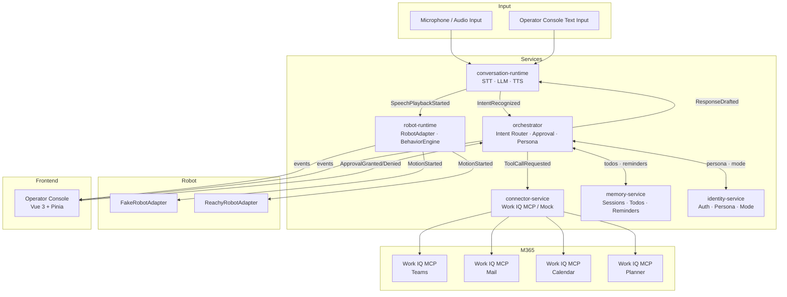

# AURA Architecture Overview

## System Summary

AURA (Adaptive Unified Robotic Assistant) is a modular, event-driven AI assistant platform running on Reachy Mini. It coordinates voice input, language model reasoning, M365 tool use, robot motion, and operator visibility through a set of loosely coupled services connected by a shared event bus.

---

## High-Level Architecture



---

## Service Responsibilities

| Service | Port | Responsibility |
|---------|------|----------------|
| `robot-runtime` | 8001 | RobotAdapter, BehaviorEngine, motion timelines, FakeRobot |
| `conversation-runtime` | 8002 | STT/TTS providers, session management, LLM turns |
| `orchestrator` | 8003 | Intent routing, approval gate, persona management, context building |
| `connector-service` | 8004 | M365Connector (Work IQ MCP or mock), MSAL auth |
| `memory-service` | 8005 | Sessions, transcripts, todos, reminders, MemoryStore |
| `identity-service` | 8006 | Placeholder: user identity, mode switching, persona persistence |

---

## Shared Packages

| Package | Contents |
|---------|----------|
| `shared-schemas` | All Pydantic event models, ABCs (RobotAdapter, STTProvider, TTSProvider, M365Connector, MemoryStore) |
| `shared-events` | AsyncEventBus, WebSocketBroadcaster |
| `shared-policies` | APPROVAL_REQUIRED list, mode access control rules |
| `shared-personas` | Persona definitions, system prompt templates |
| `shared-prompts` | LLM prompt templates |

---

## Data Flow: A Complete Voice Turn

```
1. Microphone → conversation-runtime: audio captured
2. conversation-runtime → STTProvider: transcribe audio
3. STTProvider → conversation-runtime: "What meetings do I have today?"
4. conversation-runtime → event bus: UserSpeechDetected
5. event bus → robot-runtime: BehaviorEngine → LISTENING → THINKING
6. conversation-runtime → orchestrator: POST /orchestrate {text, session_id}
7. orchestrator → ContextBuilder: assemble LLM prompt
8. orchestrator → LLM: function-call enabled completion
9. LLM → orchestrator: tool_call: list_calendar_events_today
10. orchestrator → event bus: ToolCallRequested
11. orchestrator → connector-service: GET /calendar/today
12. connector-service → Work IQ MCP: list_calendar_events
13. Work IQ MCP → connector-service: [event1, event2]
14. connector-service → orchestrator: CalendarEvent[]
15. orchestrator → event bus: ToolCallSucceeded
16. orchestrator → LLM: function result → generate response
17. LLM → orchestrator: "You have 2 meetings: standup at 9am, review at 2pm"
18. orchestrator → event bus: ResponseDrafted
19. orchestrator → conversation-runtime: {response_text}
20. conversation-runtime → TTSProvider: synthesize speech
21. conversation-runtime → robot-runtime: play_audio(speech_bytes)
22. robot-runtime → BehaviorEngine: create_speaking_timeline(text)
23. robot-runtime → RobotAdapter: execute_timeline + play_audio (synchronized)
24. event bus → operator-console: all events streaming via WebSocket
```

---

## Key Design Principles

See [constitution](.specify/memory/constitution.md) for the full governing principles. Key architecture rules:

1. **No direct SDK imports outside `robot-runtime`** — all robot access via `RobotAdapter` ABC
2. **All state changes via events** — no service calls another for state updates
3. **Approval gate for write operations** — `orchestrator.ApprovalManager` is always in the path
4. **FakeRobot is always available** — `ROBOT_ADAPTER=fake` works with no hardware
5. **M365 is always mockable** — `M365_CONNECTOR=mock` works with no credentials

---

## Technology Stack

| Layer | Technology |
|-------|-----------|
| Backend language | Python 3.11+ |
| API framework | FastAPI + asyncio |
| Data validation | Pydantic v2 |
| Package manager | uv |
| Database | SQLite (aiosqlite + SQLAlchemy async) |
| Container orchestration | Docker Compose |
| Frontend framework | Vue 3 + Vite + TypeScript + Pinia + TailwindCSS |
| LLM | OpenAI GPT-4o (configurable) |
| STT default | OpenAI Realtime API |
| STT fallback | Local Whisper |
| TTS default | OpenAI Realtime API |
| TTS fallback | Kokoro / Piper |
| M365 connector | Work IQ MCP (HTTPS, MSAL OBO) |

---

## Further Reading

- [ADR-001: Language Choice](../adr/ADR-001-language-choice.md)
- [ADR-002: Event Model](../adr/ADR-002-event-model.md)
- [ADR-003: Robot Adapter Abstraction](../adr/ADR-003-robot-adapter-abstraction.md)
- [ADR-004: Offline Fallback](../adr/ADR-004-offline-fallback.md)
- [ADR-005: Voice Pipeline](../adr/ADR-005-voice-pipeline.md)
- [ADR-006: M365 Connector Strategy](../adr/ADR-006-m365-connector.md)
