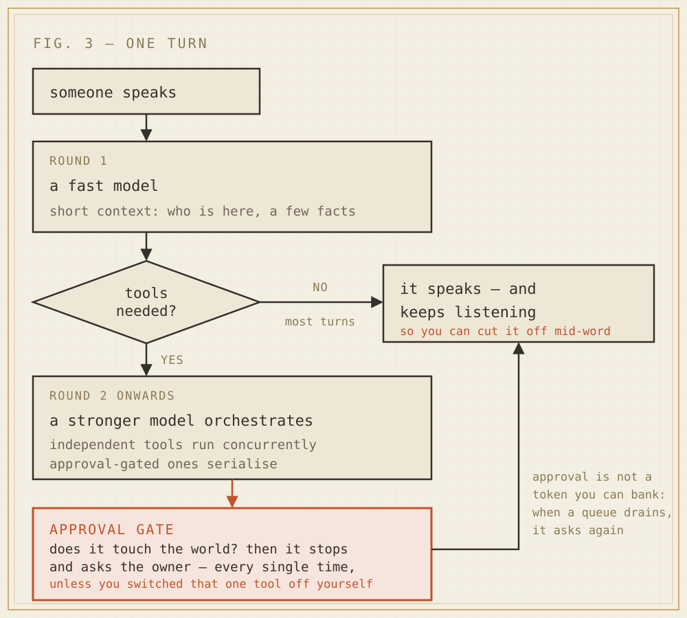
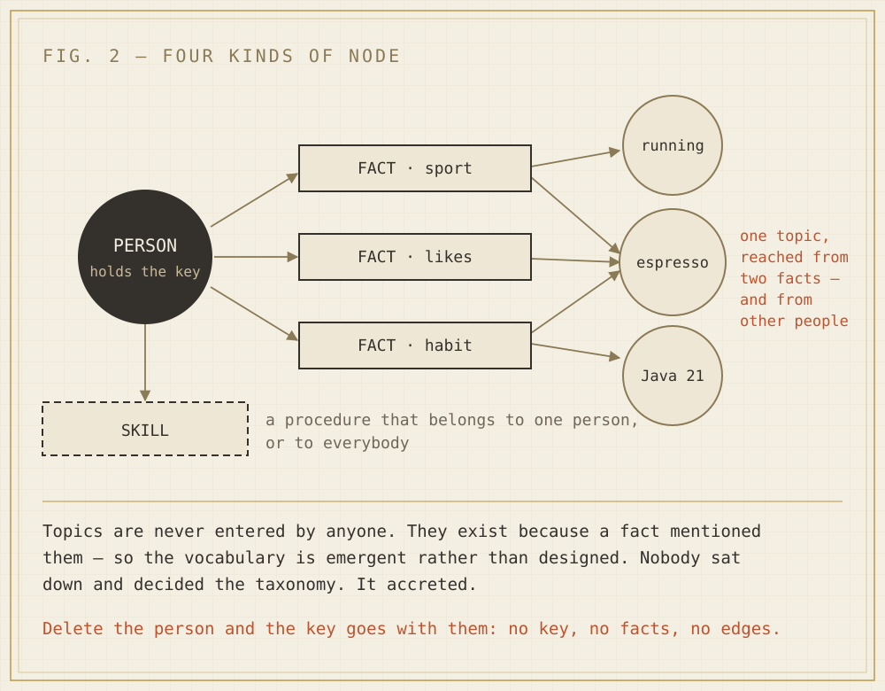
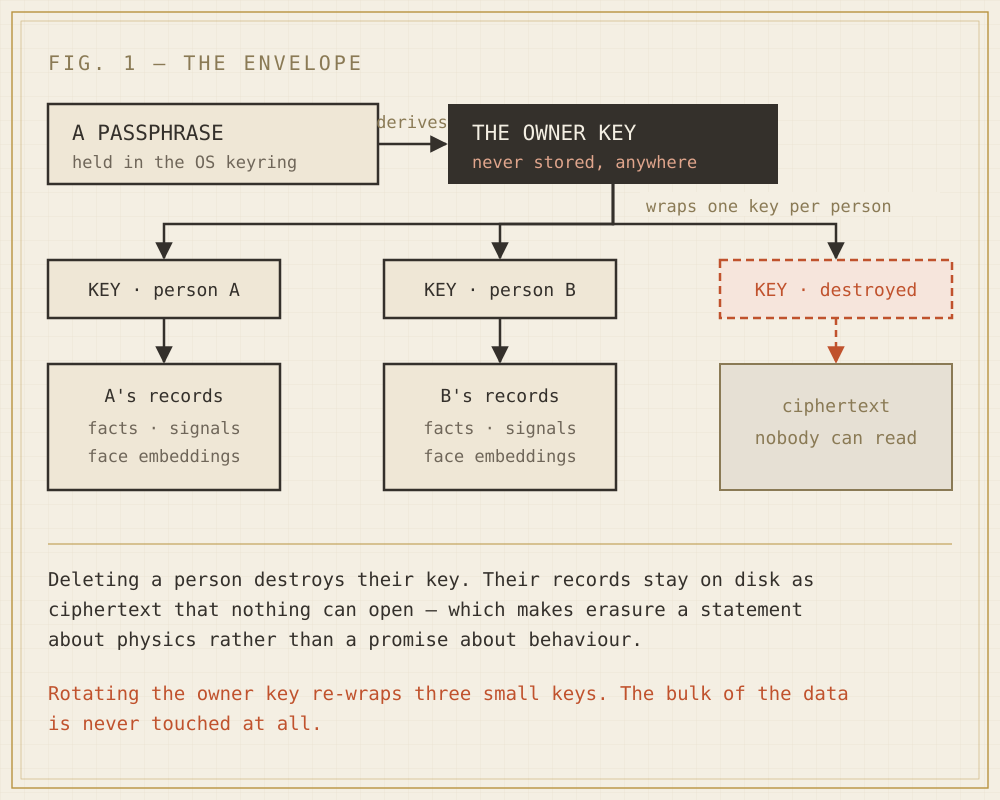
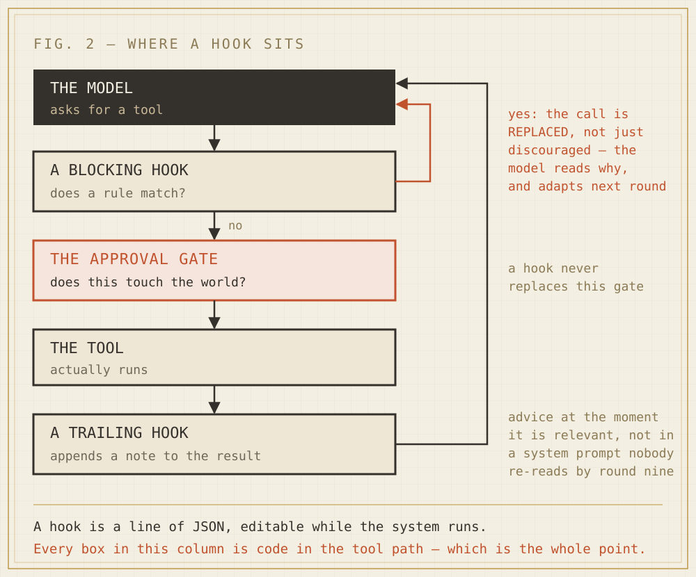
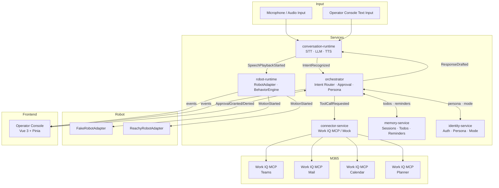

# AURA Architecture Overview

## System Summary

AURA (Adaptive Unified Robotic Assistant) is a modular, event-driven AI assistant platform running on Reachy Mini. It coordinates voice input, language model reasoning, M365 tool use, robot motion, and operator visibility through a set of loosely coupled services connected by a shared event bus.

> **Deployment note (ADR-007).** The mermaid graphs below draw the five laptop
> services as separate boxes, which is how they are *packaged and tested*. They
> are not separate **deployables**: since ADR-007 they are mounted into one
> `aura-brain` process on one in-process event bus. Six containers implied an
> independence that did not exist. Read the boxes as modules, not as processes.

---

## The drawings

The canonical drawings live in [`docs/diagrams/`](../diagrams/) and are kept true
as a rule, not a habit (constitution IX). The ones that matter most here:

### Two hosts, one trust boundary


### What listens on what

Both laptop processes are on loopback and both ports are chosen at launch. The
console talks to exactly one address — the brain — over REST plus a single
WebSocket at `/ws/events`; it never talks to the robot, not even for video. The
Wi-Fi link runs one way: the laptop calls the robot, never the reverse.


### One conversational turn



### The three media paths

The robot carries the transducers; the laptop does the thinking. No model runs
on the Pi and no key reaches it.


### What happens when something stops answering


### Three loops on three clocks

Perception is continuous, conversation is event-driven, maintenance runs every
five minutes. The interesting failures are between them, not inside them.


### The knowledge model



### Envelope encryption (ADR-008)



### Bounds on a delegated agent


### Where a hook sits



---

## High-Level Architecture


```mermaid
graph TB
    subgraph Input
        MIC[Microphone / Audio Input]
        TEXT[Operator Console Text Input]
    end

    subgraph Services
        CR[conversation-runtime<br/>STT · LLM · TTS]
        ORCH[orchestrator<br/>Intent Router · Approval · Persona]
        RR[robot-runtime<br/>RobotAdapter · BehaviorEngine]
        CS[connector-service<br/>Work IQ MCP / Mock]
        MS[memory-service<br/>Sessions · Todos · Reminders]
        IS[identity-service<br/>Auth · Persona · Mode]
    end

    subgraph Robot
        FA[FakeRobotAdapter]
        RA[ReachyRobotAdapter]
    end

    subgraph M365
        TEAMS[Work IQ MCP<br/>Teams]
        MAIL[Work IQ MCP<br/>Mail]
        CAL[Work IQ MCP<br/>Calendar]
        PLANNER[Work IQ MCP<br/>Planner]
    end

    subgraph Frontend
        OC[Operator Console<br/>Vue 3 + Pinia]
    end

    MIC --> CR
    TEXT --> CR
    CR -->|IntentRecognized| ORCH
    ORCH -->|ToolCallRequested| CS
    ORCH -->|ResponseDrafted| CR
    CR -->|SpeechPlaybackStarted| RR
    RR -->|MotionStarted| FA
    RR -->|MotionStarted| RA
    CS --> TEAMS
    CS --> MAIL
    CS --> CAL
    CS --> PLANNER
    ORCH <-->|todos · reminders| MS
    ORCH <-->|persona · mode| IS
    RR -->|events| OC
    ORCH -->|events| OC
    OC -->|ApprovalGranted/Denied| ORCH
```

---

## Service Responsibilities

| Service | Port | Responsibility |
|---------|------|----------------|
| `robot-runtime` | 8001 | RobotAdapter, BehaviorEngine, motion timelines, FakeRobot |
| `conversation-runtime` | 8002 | STT/TTS providers, session management, LLM turns |
| `orchestrator` | 8003 | Intent routing, approval gate, persona management, context building |
| `connector-service` | 8004 | M365Connector (Work IQ MCP or mock), MSAL auth |
| `memory-service` | 8005 | Sessions, transcripts, todos, reminders, MemoryStore |
| `identity-service` | 8006 | Placeholder: user identity, mode switching, persona persistence |

---

## Shared Packages

| Package | Contents |
|---------|----------|
| `shared-schemas` | All Pydantic event models, ABCs (RobotAdapter, STTProvider, TTSProvider, M365Connector, MemoryStore) |
| `shared-events` | AsyncEventBus, WebSocketBroadcaster |
| `shared-policies` | APPROVAL_REQUIRED list, mode access control rules |
| `shared-personas` | Persona definitions, system prompt templates |
| `shared-prompts` | LLM prompt templates |

---

## Data Flow: A Complete Voice Turn

```
1. Microphone → conversation-runtime: audio captured
2. conversation-runtime → STTProvider: transcribe audio
3. STTProvider → conversation-runtime: "What meetings do I have today?"
4. conversation-runtime → event bus: UserSpeechDetected
5. event bus → robot-runtime: BehaviorEngine → LISTENING → THINKING
6. conversation-runtime → orchestrator: POST /orchestrate {text, session_id}
7. orchestrator → ContextBuilder: assemble LLM prompt
8. orchestrator → LLM: function-call enabled completion
9. LLM → orchestrator: tool_call: list_calendar_events_today
10. orchestrator → event bus: ToolCallRequested
11. orchestrator → connector-service: GET /calendar/today
12. connector-service → Work IQ MCP: list_calendar_events
13. Work IQ MCP → connector-service: [event1, event2]
14. connector-service → orchestrator: CalendarEvent[]
15. orchestrator → event bus: ToolCallSucceeded
16. orchestrator → LLM: function result → generate response
17. LLM → orchestrator: "You have 2 meetings: standup at 9am, review at 2pm"
18. orchestrator → event bus: ResponseDrafted
19. orchestrator → conversation-runtime: {response_text}
20. conversation-runtime → TTSProvider: synthesize speech
21. conversation-runtime → robot-runtime: play_audio(speech_bytes)
22. robot-runtime → BehaviorEngine: create_speaking_timeline(text)
23. robot-runtime → RobotAdapter: execute_timeline + play_audio (synchronized)
24. event bus → operator-console: all events streaming via WebSocket
```

---

## Key Design Principles

See [constitution](../../.specify/memory/constitution.md) for the full governing principles. Key architecture rules:

1. **No direct SDK imports outside `robot-runtime`** — all robot access via `RobotAdapter` ABC
2. **All state changes via events** — no service calls another for state updates
3. **Approval gate for write operations** — `orchestrator.ApprovalManager` is always in the path
4. **FakeRobot is always available** — `ROBOT_ADAPTER=fake` works with no hardware
5. **M365 is always mockable** — `M365_CONNECTOR=mock` works with no credentials
6. **Nothing is reported that has not been verified** — a missing measurement
   renders as an absence, a mock says it is a mock, and `unknown` is not a
   status (ADR-009)
7. **The Pi is older than the app** — every new brain→runtime call tolerates a
   404 and reports the degradation instead of success (constitution X)
8. **The console composes presentation, never truth** — every status,
   capability and knowledge state comes from the brain
9. **Specs are living artifacts** — a unit that changes behaviour updates the
   spec that describes it, and CI checks the link (spec 015)

---

## Technology Stack

| Layer | Technology |
|-------|-----------|
| Backend language | Python 3.11+ |
| API framework | FastAPI + asyncio |
| Data validation | Pydantic v2 |
| Package manager | uv |
| Database | SQLite (aiosqlite + SQLAlchemy async) |
| Delivery | Electron desktop app (ADR-010); Docker Compose for development and CI |
| Frontend framework | Vue 3 + Vite + TypeScript + Pinia + TailwindCSS |
| LLM | OpenAI GPT-4o (configurable) |
| Speech | **Three paths**, chosen in Settings: pipeline (tools, cheaper), per-turn realtime, realtime session (server VAD). See ADR-005's amendment |
| Wake word | openWakeWord, ONNX, on the CPU — with a network fallback |
| STT / TTS providers | OpenAI; local Whisper and Kokoro/Piper as fallbacks |
| Connectors | Microsoft 365 (Work IQ MCP, MSAL OBO), Google, GitHub, Slack, owner-added MCP servers, calendar-by-`.ics`-link |
| Traceability | `scripts/spec_drift.py` — every unit claimed by a spec, checked in CI |

---

## Further Reading

- [ADR-001: Language Choice](../adr/ADR-001-language-choice.md)
- [ADR-002: Event Model](../adr/ADR-002-event-model.md)
- [ADR-003: Robot Adapter Abstraction](../adr/ADR-003-robot-adapter-abstraction.md)
- [ADR-004: Offline Fallback](../adr/ADR-004-offline-fallback.md)
- [ADR-005: Voice Pipeline](../adr/ADR-005-voice-pipeline.md)
- [ADR-006: M365 Connector Strategy](../adr/ADR-006-m365-connector.md)
- [ADR-007: Topology and Capability Reshape](../adr/ADR-007-topology-and-capability-reshape.md)
- [ADR-008: Personal Knowledge & Judgment Layer](../adr/ADR-008-knowledge-judgment-layer.md)
- [ADR-009: Honest State](../adr/ADR-009-honest-state.md)
- [ADR-010: The Desktop App is the Delivery Unit](../adr/ADR-010-desktop-app-is-the-delivery-unit.md)

**ADR-002, ADR-004, ADR-005, ADR-006, ADR-007 and ADR-008 carry 2026-09-05
amendments.** ADR-005 is partly superseded: the voice pipeline it describes is
one of three paths. Read the amendments before relying on the original text.

### The specifications

Feature specs live in [`.specify/specs/`](../../.specify/specs/) and are the
description of what the product does **today**;
[`docs/implementation-backlog.md`](../implementation-backlog.md) is the history
of how it got there. Start with
[015-spec-coverage](../../.specify/specs/015-spec-coverage/spec.md), which
explains why the two were disconnected for 292 units and what now keeps them
together.
