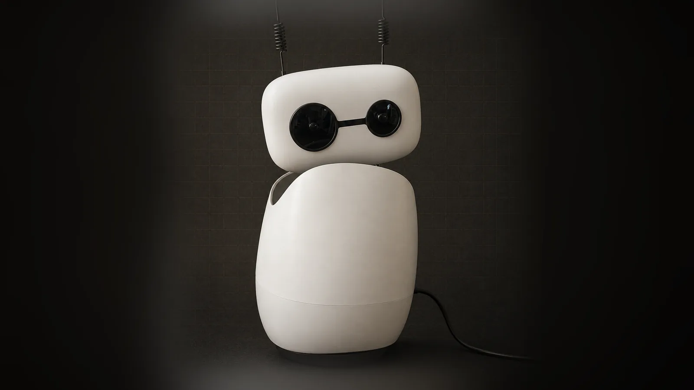
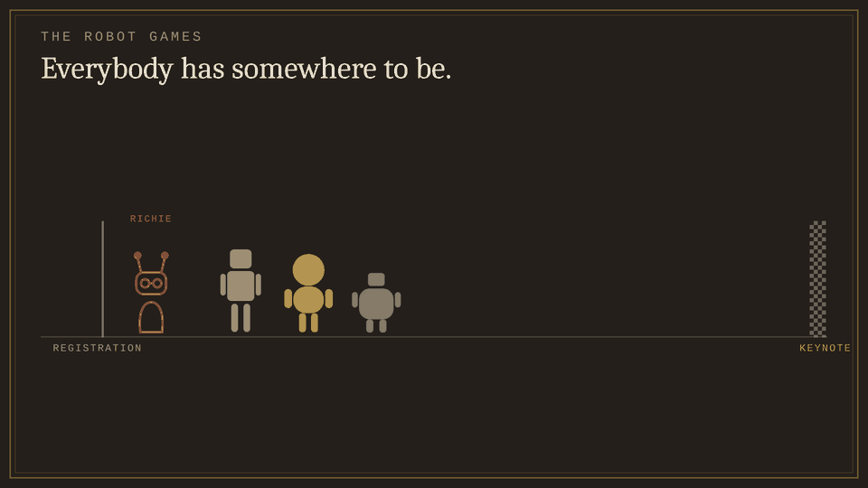

# From the talks

AURA was presented at Devoxx 2026 in two talks. This page keeps the parts of
them that explain the system, and points each one at the code or the canonical
drawing it shows.

  

**These are pictures of the system on the day they were made.** The canonical
drawings live in [`../diagrams/`](../diagrams/) and are kept true with every
change; when a picture here and a drawing there disagree, the drawing wins and
this page is out of date.

| | Keynote | Conference talk |
|---|---|---|
| Title | *From Brainless to Brilliant — giving an open-source robot a mind of its own* | *I Hired a Real Robot as My Junior Dev — and now my kids don't want to learn Java anymore* |
| Shape | One ordinary day in a kitchen, hour by hour, with the robot on the table | The architecture, the agentic loops, the skills it writes for itself — "five things that fought me, and what the architecture became" |
| What the robot did on stage | [`keynote.scenario.yaml`](../demo/keynote.scenario.yaml) | [`conference-talk.scenario.yaml`](../demo/conference-talk.scenario.yaml) (Dutch, as given) |

The robot was not a prop in either talk. It co-presented from a scenario —
lines recorded once when the talk starts, beats on slides and on spoken
keywords, wandering and following set per slide. The format is
[`../demo/scenario-format.md`](../demo/scenario-format.md), and
`python scripts/check_scenario.py <file>` prints what a talk will do before
you are on stage.

---

## What the brain actually does

The keynote's one-slide answer to "what is running on the laptop", every item
of which is in this repository.

![What the brain on the laptop actually does, in eight groups. Senses: wide-angle camera, four microphones, wake word, face recognition, it reacts while you are still talking. Memory: facts you told it, signals it inferred, confidence it has to earn, topics it links itself, the whole household every turn, encrypted per person. Thinking: an agentic loop with a round budget, bounded sub-agents, dozens of tools, a judgment layer per turn, three ways to talk to it, every round on an event bus. Learning: writes its own procedures, triggers in plain English, notices what keeps failing, and cannot save any of it. Hands: mail and calendar, music, the browser, VS Code and Claude Code, the things with no API, the screen itself. Body: a head that turns every way yours does, it follows you, ten characters, antennae that answer you, present-mode overlay. People: owner, family, minor with no inferences, guest, a different amount of me each time. The brakes: every sensitive action asks, allows / asks / blocked, read-only delegation, a gate in code, not in a prompt.](media/what-the-brain-does.webp)

## One turn, eight rounds

Round one is a fast model on a short context, and most turns end there. A turn
that needs tools switches to the capable model, may delegate a read-only
sub-task with its own four-round budget, and stops at the approval gate before
anything touches the outside world. Every step is an event on the bus — which
is also how the console shows it.

The drawing: [`one-turn.svg`](../diagrams/one-turn.svg). The code: the agentic
loop in [`pipeline.py`](../../services/orchestrator/src/orchestrator/pipeline.py)
(`AGENT_MAX_ROUNDS`, default 8) and the sub-agent bounds in
[`delegation-bounds.svg`](../diagrams/delegation-bounds.svg).

## What it does when things break

Not one of these rungs is "wait". Three failed heartbeats drop a tier; thirty
clean seconds climb back.

The drawing: [`degradation-ladder.svg`](../diagrams/degradation-ladder.svg). The
code: [`heartbeat.py`](../../services/orchestrator/src/orchestrator/heartbeat.py)
and ADR-004.

## It can propose a skill. It cannot save one.

A real rewrite proposal, as shown in the keynote: the procedure it uses now on
the left, what it would change on the right, and why, in its own words. Nothing
is written until the owner applies it — and since ADR-013 a rewrite can reword
a built-in skill's guardrails but never remove them.

Spec [019](../../.specify/specs/019-skills-and-automation/spec.md),
[ADR-013](../adr/ADR-013-built-in-guardrails-survive-every-rewrite.md).

---

## Three figures that are not in `docs/diagrams/`

They describe a moment in the project's history rather than its current shape,
which is why they live here and not among the canonical drawings.

### The first design

Six services, seven containers, six Dockerfiles and six health checks — for one
robot, one desk and one user. ADR-007 collapsed it into the one brain process
the system runs today.

[ADR-007](../adr/ADR-007-topology-and-capability-reshape.md) ·
[`trust-boundary.svg`](../diagrams/trust-boundary.svg) is what it became.

### The loop that closed through the air

The robot speaks into a room that contains a fridge, a hard wall and its own
microphone. No architecture diagram has an arrow for that — and it is where
most of the voice work went.

[`voice-conversation.md`](../voice-conversation.md) and the "speaker feeding
back into the microphone" hazard in [`three-loops.svg`](../diagrams/three-loops.svg).

### The threat model

The encryption was sound; the passphrase sat in a settings file in the same
folder as the encrypted stores, readable by anything that could read them. It
now lives only in the OS credential store.

[ADR-008](../adr/ADR-008-knowledge-judgment-layer.md) ·
[`envelope-encryption.svg`](../diagrams/envelope-encryption.svg).

---

## The rest of the conference talk's figures

They are the canonical drawings, rendered for the slides. Read them here:

| In the talk | In this repository |
|---|---|
| Two deployables | [`trust-boundary.svg`](../diagrams/trust-boundary.svg) |
| The envelope | [`envelope-encryption.svg`](../diagrams/envelope-encryption.svg) |
| Four kinds of node | [`knowledge-model.svg`](../diagrams/knowledge-model.svg) |
| Three loops, three clocks | [`three-loops.svg`](../diagrams/three-loops.svg) — four loops today: wandering was added after the talk was drawn |
| One unit through the loop | [`build-loop.svg`](../diagrams/build-loop.svg) |
| What a delegated agent may reach | [`delegation-bounds.svg`](../diagrams/delegation-bounds.svg) |
| The degradation ladder | [`degradation-ladder.svg`](../diagrams/degradation-ladder.svg) |

The talk's **automation ladder** slide is not reproduced: it has five rungs,
and the desktop rung (any installed app, its windows and its keyboard
shortcuts) was added after it. The current ladder is `LADDER_NOTE` in
[`tool_schemas.py`](../../services/orchestrator/src/orchestrator/tool_schemas.py).

## A box, a screwdriver, one evening

## Please Do Not Throw Richie

The keynote closed with a small game: a robot with a keynote to give and no
legs to get there. It is its own project, at
[janvanwassenhove.github.io/PleaseDoNotThrowRichie](https://janvanwassenhove.github.io/PleaseDoNotThrowRichie).

---

## Not here, on purpose

- **Screens and photos with real household data.** The talks show real people
  and real memories; this repository is public, and the privacy gate exists so
  that none of it reaches git. The README's screenshots come from a throwaway
  stack for the same reason.
- **The illustrated scenes.** Some story slides are generated illustrations.
  Everything on this page shows what the system really is or really did.
- **The slide decks themselves.** They are the speaker's, not the project's.
